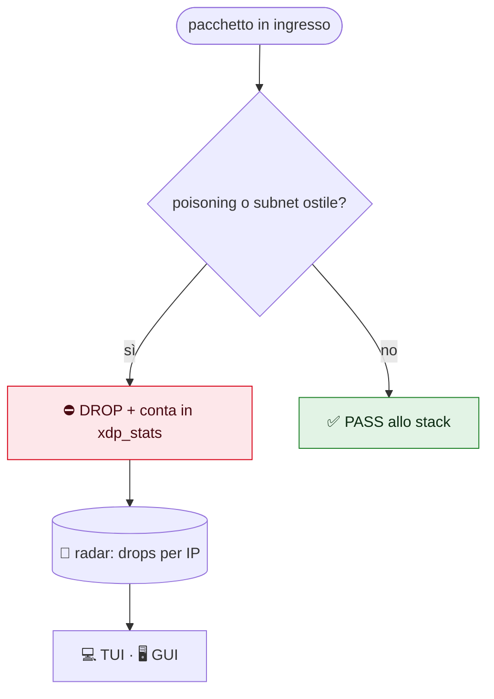
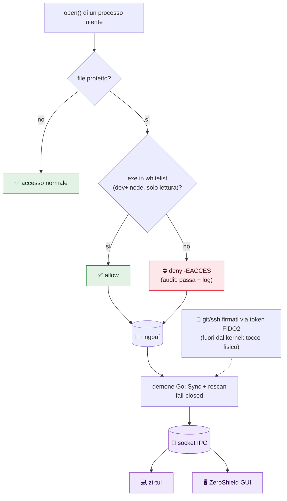

<p align="center">
  
</p>
<h1 align="center">ZeroShield</h1>
<p align="center"><b>Lo scudo zero-trust nel tuo kernel Linux.</b><br/>
Difende segreti e rete del portatile da Wi-Fi ostili, dipendenze avvelenate e ladri di token — senza server, senza cloud, senza account.</p>
<p align="center">
  <a href="#-provalo-in-60-secondi-senza-root">Provalo in 60 secondi</a> ·
  <a href="#interfacce-tui--gui-senza-root">TUI + GUI</a> ·
  <a href="#-profili">Profili</a> ·
  <a href="TESTING_LAB.md">Lab di test</a>
</p>
<p align="center"><i>MIT © 2026 ZioZoni95 · binari: <code>zt-shield</code> <code>zt-tui</code> <code>zt-gui</code></i></p>

---

## ⚡ Provalo in 60 secondi (senza root)

Niente kernel, niente rischi: dati finti, solo per vedere le interfacce.

```bash
make build-tui build-mock
ZT_SOCKET=/tmp/z.sock ./bin/zt-mockd &
ZT_SOCKET=/tmp/z.sock ./bin/zt-tui   # tab Stato · Eventi · Regole · Rete · Radar
```

## 🛡️ Come ti protegge (quando lo attivi)

| 🛡️ | Livello | Esempio concreto |
|---|---|---|
| 🔒 | **Segreti** (eBPF LSM) | `cat ~/.aws/credentials` da script malevolo → `Permesso negato`, `kubectl` continua a funzionare |
| 📡 | **Radar rete** (eBPF XDP) | Poisoning LLMNR/mDNS e scansioni droppate prima dello stack, sorgenti sul radar |
| 🧱 | **Sistema** | Firewall deny-incoming, DNS cifrato, anti ARP-spoof |
| 🔑 | **Identità** (FIDO2) | Commit firmati col tocco fisico: senza token, niente firma |

> **Kernel-Enforced Local Security Agent for Linux Workstations**
> *Difesa in profondità locale a livello kernel contro reti ostili, malware che ruba credenziali e movimenti laterali.*

---

## 📋 Panoramica

`zt-shield` è un agente di sicurezza locale per postazioni Linux (sviluppo e uso quotidiano) che operano in reti non fidate o su cui può girare codice non fidato.

Implementa il paradigma **Zero-Trust ("Never Trust, Always Verify")** a livello kernel con **eBPF (XDP + LSM)**, affiancato da hardening del sistema operativo e credenziali hardware non estraibili (**FIDO2**). Non richiede un'infrastruttura: gira sul tuo portatile.

### Contro cosa protegge

| Scenario | Minaccia | Cosa fa lo scudo |
|---|---|---|
| **Wi-Fi pubblico** (hotel, aeroporto, bar) | Poisoning LLMNR/mDNS/NBT-NS, ARP spoofing, DNS ostile, scansioni di altri client | Drop XDP dei protocolli di poisoning, firewall `deny incoming`, DNS cifrato (DoT) ignorando quello del DHCP, sysctl anti-redirect/ARP |
| **Supply-chain** (dipendenza npm/PyPI/Cargo compromessa, script `curl \| sh`) | Il codice gira con i tuoi permessi e legge `~/.ssh`, `~/.aws`, token, cookie | LSM: solo i binari in whitelist aprono i segreti, ogni altro tentativo è negato e loggato con PID ed exe |
| **Infostealer / malware utente** | Esfiltrazione di cookie e password del browser, chiavi, wallet | Regole `browsers`, `gpg`, `tokens` + regole personalizzate (`extra_rules`) |
| **LAN domestica** (IoT, ospiti, altri PC) | Dispositivi compromessi che sondano la macchina | `deny incoming`, drop poisoning, blocco subnet opzionale |
| **Rete aziendale / dominio compromesso** | DNS spoofing, movimento laterale, poisoning tramite Responder/Inveigh | Come sopra + `block_subnets` per le subnet ostili |
| **Furto/impersonificazione dell'identità** | Chiave SSH rubata, commit falsificati a tuo nome | Chiavi FIDO2 `ed25519-sk` (PIN + tocco), commit firmati |

Ogni scenario ha un **profilo** pronto (vedi [Profili](#-profili)).





---

## 🗂️ Struttura della Repository

```text
personal_zeroT/
├── README.md                   # Questo file
├── LICENSE                     # MIT © 2026 ZioZoni95
├── PUNTI_APERTI.md             # Stato, decisioni aperte e checklist
├── FIX_APPLICATI.md            # Fix applicati e ancora da applicare
├── TESTING.md                  # Scenari di collaudo pratico (LSM, XDP, network namespaces)
├── TESTING_LAB.md              # Scenario lab reale in VM isolata (post-fix)
├── UI_RESEARCH.md              # Ricerca TUI/GUI e architettura IPC
├── gemini-code-1790668303538.md # Specifiche tecniche iniziali e storico evolutivo
├── Makefile                    # make build | build-tui | build-mock | gui | test | clean
├── go.mod
├── bpf/
│   ├── zerotrust.c             # Kernel C: XDP (rete) e LSM (file_open)
│   └── gen.go                  # go:generate bpf2go (stub Go generati, non versionati)
├── cmd/zt-shield/main.go       # Entrypoint del demone
├── cmd/zt-tui/main.go          # TUI Bubble Tea (stato/eventi live, senza root)
├── cmd/zt-mockd/main.go        # Finto demone con dati sintetici (verifica UI senza root/eBPF)
├── pkg/ipc/                    # Socket Unix stato+eventi (demone root → UI utente)
├── zt-gui/                     # GUI desktop Wails stile macOS (vedi UI_RESEARCH.md)
├── internal/
│   ├── config/                 # Profili, regole, parsing YAML, validazione (+ test)
│   ├── lsm/                    # Sync mappe file/binari, attach hook LSM
│   ├── xdp/                    # Attach XDP (generic), trie LPM subnet
│   └── audit/                  # Consumer ring buffer, output text/JSON
├── configs/shield.example.yaml # Configurazione commentata
└── scripts/
    ├── check_prereqs.sh        # Kernel, BTF, LSM bpf, toolchain
    ├── harden_system.sh        # Hardening per profilo: UFW, resolved, sysctl
    ├── setup_fido2.sh          # Chiave SSH FIDO2 + firma commit Git
    └── install_service.sh      # Installazione come servizio systemd
```

---

## 🎯 I Quattro Livelli di Protezione

### 1. Network Layer (eBPF XDP + UFW)
* **Drop dei protocolli di poisoning:** LLMNR (5355), mDNS (5353), NBT-NS (137/138) scartati in ingresso prima dello stack TCP/IP. Attivo di default (`block_poisoning`).
* **Blocco subnet opzionale:** `block_subnets` con Longest Prefix Match. Attenzione: scarta anche le risposte da quelle reti.
* **Supporto universale:** `XDP_GENERIC`, funziona su Wi-Fi, Ethernet e VPN.
* **Firewall:** UFW `default deny incoming` (via `harden_system.sh`).

### 2. Secret & Data Layer (eBPF LSM)
* **Regole per gruppo di segreti:** ogni regola associa file (percorsi, glob, directory ricorsive) ai soli binari autorizzati.
* **Identità del binario, non del nome:** la whitelist confronta dev+inode dell'eseguibile (`mm->exe_file`). Rinominare un binario in `ssh` non basta.
* **Chiave dev+inode:** sopravvive a rename; il rescan (default 30s) copre file nuovi, binari aggiornati da apt e rimuove voci obsolete.
* **Modalità `audit` / `enforce`:** `audit` logga senza bloccare, per adottare lo scudo senza rompere i flussi di lavoro.
* **Audit in tempo reale:** ogni evento riporta regola, PID, `comm` ed `exe` del processo (utile per decidere cosa autorizzare); formato `text` o `json`.
* **Fail-closed:** se l'hook LSM non si aggancia, il demone si ferma invece di fingersi attivo.

### 3. Identity & Non-Repudiation Layer (FIDO2)
* **Chiavi non estraibili:** `ed25519-sk` residente, PIN + tocco (`verify-required`). Senza token, `setup_fido2.sh` ripiega su una chiave software (protezione più debole).
* **Commit firmati** via SSH con `allowed_signers` per la verifica locale.
* **Anti SSH-agent hijacking:** `ssh-add -c` per le chiavi software.

### 4. Protocol & OS Hardening
* **Anti-poisoning:** LLMNR e mDNS disattivati in `systemd-resolved`.
* **DNS sicuro (profili `public-wifi`/`paranoid`):** DNS-over-TLS verso resolver globali, ignorando quelli del DHCP; DNSSEC `allow-downgrade`.
* **Sysctl di rete:** niente ICMP redirect / source routing, `rp_filter` loose, meno informazioni ARP su reti ostili.
* **Servizi di discovery:** `avahi-daemon` disabilitato nei profili per reti non fidate.

---

## 🧩 Profili

| Profilo | Modalità | Regole | Hardening (`harden_system.sh`) |
|---|---|---|---|
| `home` *(default)* | `audit` | ssh, cloud, tokens, gpg | UFW, no LLMNR/mDNS, sysctl base |
| `corporate` | `enforce` | ssh, cloud, tokens, gpg | come `home`; DNS interni mantenuti |
| `public-wifi` | `enforce` | + browsers (cookie, password) | + DoT opportunistic, `Domains=~.`, ARP, avahi off |
| `paranoid` | `enforce` | come `public-wifi` | DoT `yes` (senza captive portal) |

Gruppi di regole:

| Gruppo | Protegge | Autorizzati |
|---|---|---|
| `ssh` | `~/.ssh/id_*` | ssh, ssh-add, ssh-agent, ssh-keygen, scp, sftp |
| `cloud` | `.kube/config`, `.aws/credentials`, credenziali Terraform | kubectl, helm, k9s, aws, terraform, tofu |
| `tokens` | `.git-credentials`, `.docker/config.json`, `gh/hosts.yml`, `.cargo/credentials.toml` | git, gh, docker, cargo |
| `gpg` | `~/.gnupg/private-keys-v1.d/` | gpg, gpg-agent, gpgsm |
| `browsers` | Cookie, Login Data, `key4.db`, `logins.json` di Chrome/Chromium/Firefox (anche snap) | i binari dei browser |

Aggiungi i tuoi segreti (wallet crypto, password manager, ecc.) con `extra_rules` in [`configs/shield.example.yaml`](configs/shield.example.yaml).

> [!IMPORTANT]
> Tool con shebang (`npm`, `pip`, `gcloud`, `az`) **non sono in whitelist** di proposito: il processo che apre il file è l'interprete (`node`, `python`), e autorizzarlo autorizzerebbe qualunque script, compresi gli `postinstall` malevoli. Per quei token usa credenziali a breve durata o un keyring.

---

## ⚙️ Prerequisiti di Sistema

* **OS:** Ubuntu 22.04 / 24.04 o qualsiasi Linux con kernel >= 5.15 e BTF (`/sys/kernel/btf/vmlinux`).
* **BPF LSM attivo nel kernel:**
  ```bash
  cat /sys/kernel/security/lsm
  ```
  Se manca `bpf`, **appendilo alla lista esistente** (non sostituirla):
  ```bash
  CURRENT_LSM="$(cat /sys/kernel/security/lsm)"
  sudo cp /etc/default/grub /etc/default/grub.bak
  sudo sed -i "s|^GRUB_CMDLINE_LINUX=\"|GRUB_CMDLINE_LINUX=\"lsm=${CURRENT_LSM},bpf |" /etc/default/grub
  sudo update-grub && sudo reboot
  ```
* **Toolchain:**
  ```bash
  sudo apt update
  sudo apt install -y clang llvm libbpf-dev linux-tools-common linux-tools-generic bpftool golang-go make libfido2-dev fido2-tools ufw
  ```
  Serve Go >= 1.22 (se l'apt è più vecchio: `sudo snap install go --classic`).

---

## 🚀 Guida Rapida

```bash
# 1. Verifica prerequisiti
bash scripts/check_prereqs.sh

# 2. Compila (genera vmlinux.h, stub eBPF, binario)
make build

# 3. Prova in primo piano (profilo home = solo audit, non blocca nulla)
sudo SHIELD_USER=$USER ./bin/zt-shield

# 4. Hardening di sistema per il tuo scenario
sudo bash scripts/harden_system.sh home        # oppure: corporate | public-wifi | paranoid

# 5. Identità hardware (opzionale ma consigliato)
bash scripts/setup_fido2.sh

# 6. Installa come servizio e osserva i log
sudo bash scripts/install_service.sh $USER home
journalctl -u zt-shield -f
```

**Adozione consigliata:** tieni `mode: audit` finché nei log non compaiono più accessi legittimi (`exe=...` ti dice quale binario autorizzare), poi passa a `mode: enforce` in `/etc/zt-shield/shield.yaml` e riavvia il servizio.

### Collaudo
```bash
cat ~/.kube/config                                       # enforce: Permission denied; il log mostra regola, PID, exe
cp /usr/bin/cat /tmp/ssh && /tmp/ssh ~/.kube/config      # deve restare negato (whitelist per identità, non per nome)
kubectl get pods                                         # consentito
```

---

## 🚧 Limiti noti

* **Root locale = game over:** chi ha root può scaricare gli hook eBPF. Lo scudo difende da processi utente compromessi e dalla rete, non da un privilege escalation riuscito.
* **Solo `file_open`:** niente hook su `unlink`/`rename`/`ptrace`. Un processo con lo stesso UID può fare `ptrace` su un `ssh` in esecuzione (mitigato da `kernel.yama.ptrace_scope=1`, default Ubuntu).
* **Whitelist per binario, non per catena:** un `git` lanciato da uno script malevolo può leggere `.git-credentials`. Il segreto forte è la chiave FIDO2.
* **XDP solo IPv4, un solo tag VLAN, niente IPv6.** LLMNR/mDNS IPv6 coperti solo da `systemd-resolved`. `interface` accetta lista (`"wlan0,eth0"`); interfacce UP scoperte segnalate nel log.
* **Non sostituisce una VPN:** su Wi-Fi pubblico lo scudo riduce la superficie ma non cifra il traffico.
* **Browser:** i percorsi predefiniti coprono deb e snap; Flatpak e installazioni custom vanno aggiunti in `extra_rules`. Verifica in `audit` prima di passare a `enforce`, altrimenti il browser può perdere i cookie.
* **btrfs (subvolume):** `st_dev` userspace ≠ `s_dev` kernel, la chiave dev+inode non matcha. Su ext4/xfs funziona.

---

## 🖥️ Interfacce: TUI + GUI (senza root)

Il demone gira root e pubblica stato/eventi sul socket `/run/zt-shield/api.sock` (`pkg/ipc`). Le interfacce girano come utente, in sola lettura: niente eBPF toccato dalle UI.

| Strumento | Cosa è | Avvio |
|---|---|---|
| `zt-tui` | Terminale a tab (Stato/Eventi/Regole/Rete/Radar, live) | `./bin/zt-tui` (demone attivo) |
| `zt-mockd` | Finto demone con dati inventati, per vedere le UI senza root né eBPF | `ZT_SOCKET=/tmp/z.sock ./bin/zt-mockd &` + `ZT_SOCKET=/tmp/z.sock ./bin/zt-tui` |
| `zt-gui` | Finestra desktop stile macOS (sidebar, badge mode, eventi live) | `make gui`, poi `./zt-gui/build/bin/zt-gui` |

```bash
make build-tui   # TUI (pura Go, senza toolchain eBPF)
make build-mock  # mock (idem)
make gui         # GUI (richiede wails CLI, Node, libgtk-3-dev, libwebkit2gtk-4.1-dev)
```

Anteprima TUI senza TTY: `./bin/zt-tui --dump`. Nota: fuori da env snap le GUI GTK vanno lanciate con `GTK_PATH`/`GIO_MODULE_DIR` ripuliti (vedi `PUNTI_APERTI.md`). Dettagli ricerca in [`UI_RESEARCH.md`](UI_RESEARCH.md).

<details><summary>Anteprima tab Radar (dati di esempio)</summary>

```
🛡️ zt-shield  ● AUDIT (logga)
 1 Stato   2 Eventi   3 Regole   4 Rete  [5 Radar]

        ···●·······
     ····         ····
 ·   ··  ···   ···  ··   ·
 ·   ·   ·   +∙∙∙∙∙●∙∙∙∙∙·
   ··   ··········●   ··

192.168.100.7      34  █████ poisoning
192.168.100.23    128  ██████████████████ subnet
```
</details>

---

## 📖 Riferimenti
* Specifiche tecniche iniziali e storico evolutivo: [gemini-code-1790668303538.md](gemini-code-1790668303538.md).
* Stato e attività aperte: [PUNTI_APERTI.md](PUNTI_APERTI.md).
* Guida agli scenari di collaudo pratico: [TESTING.md](TESTING.md).
