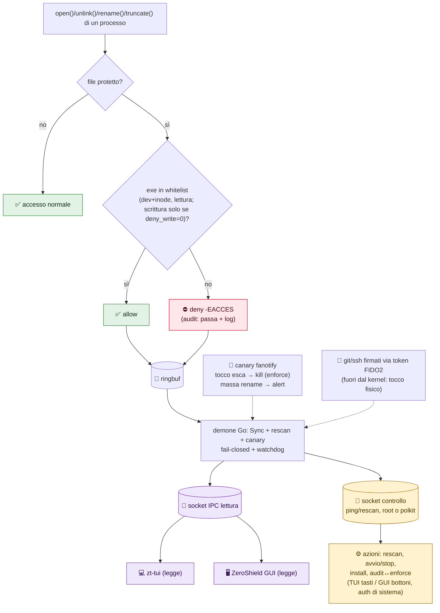

<p align="center">
  
</p>
<h1 align="center">ZeroShield</h1>
<p align="center"><b>Lo scudo zero-trust nel tuo kernel Linux.</b><br/>
Difende segreti e rete del portatile da Wi-Fi ostili, dipendenze avvelenate e ladri di token — senza server, senza cloud, senza account.</p>
<p align="center">
  <a href="#-guarda-le-interfacce-in-60-secondi-demo-dati-finti">Demo 60 secondi</a> ·
  <a href="#interfacce-tui--gui-senza-root">TUI + GUI</a> ·
  <a href="#-profili">Profili</a> ·
  <a href="docs/TESTING_LAB.md">Lab di test</a>
</p>
<p align="center"><i>MIT © 2026 ZioZoni95 · binari: <code>zt-shield</code> <code>zt-tui</code> <code>zt-gui</code></i></p>
<p align="center">
  <a href="https://github.com/ZioZoni95/personal_zeroT/actions/workflows/ci.yml"></a>
  
  
  
  
  
  
</p>

> [!WARNING]
> **Progetto sperimentale, mai testato su macchina fisica.** Gli hook LSM che proteggono i
> segreti passano il verifier del kernel, ma non sono mai stati **agganciati** su una
> macchina reale: il blocco effettivo dei file non è ancora stato visto funzionare. Usalo in **VM** e in modalità `audit` finché
> `zt-probe` e il collaudo di [`docs/TESTING_LAB.md`](docs/TESTING_LAB.md) non passano
> sulla tua macchina. Stato dettagliato in [`docs/TEST_SANDBOX.md`](docs/TEST_SANDBOX.md).

| Componente | Stato | Come è stato verificato |
|---|---|---|
| XDP anti-poisoning + radar | ✅ **testato su kernel reale** | `zt-probe -xdp-lo`: verifier ok, 5355/5353 droppati, 9999 passa |
| Canary anti-ransomware (fanotify) | ✅ **testato su kernel reale** | tocco esca, allarme di massa, kill in enforce (`make test-root`) |
| TUI / GUI / mock | ✅ testato | TUI: test unitari + `--dump`. GUI: **l'app vera del pacchetto avviata sotto Xvfb contro `zt-mockd`** (si collega, mostra stato, eventi, versione) e il frontend in un browser con demone simulato (21 controlli, `zt-gui/frontend/tests/gui.test.mjs`) |
| **Demone `zt-shield` end-to-end** | ⚠️ **mai avviato** | non parte senza BPF LSM (fail-closed, voluto). Il collegamento di IPC, stato VPN e porte in ascolto dentro il demone è compilato, analizzato (`vet`, staticcheck) e coperto dai test dei singoli pacchetti, ma **mai eseguito insieme** |
| Config, IPC, audit, whitelist, `netstat` | ✅ test unitari | `go test -race`, fuzz, CI; socket IPC provato con utenti reali (protetto sì, altro utente no) |
| **Hook LSM (segreti)** | 🟡 **verifier ok, mai agganciato** | `zt-probe` in CI: i 4 programmi accettati dal kernel del runner GitHub; attach + blocco reale da provare in VM |
| Pacchetti `.deb` | ✅ costruiti, installati qui e **pubblicati** | installazione, reinstallazione, rimozione (`make package`); [release v0.0.1](https://github.com/ZioZoni95/personal_zeroT/releases) (pre-release ⚠️ ALPHA) |
| Kill-switch VPN (`vpn_killswitch.sh`) | 🟡 **provato in un network namespace** | 54 controlli (`scripts/test_killswitch.sh`, previsto nel workflow CI): mai su una rete reale, mai con un tunnel vero |
| Auto-VPN (`nm_vpn.sh`), helper Proton | 🟡 **provati con comandi finti** | `scripts/test_nm_vpn.sh`, `scripts/test_proton.sh`: mai con NetworkManager vero né con ProtonVPN |
| Script (`harden_system.sh`, `setup_fido2.sh`) | ⚠️ mai eseguiti | solo `shellcheck` / `bash -n` |

---

## ⚡ Guarda le interfacce in 60 secondi (demo, dati finti)

Non è una prova della protezione (nessun kernel coinvolto): solo le UI con dati inventati, per decidere se ti piace come sono fatte.

```bash
make build-tui build-mock
ZT_SOCKET=/tmp/z.sock ./bin/zt-mockd &
ZT_SOCKET=/tmp/z.sock ./bin/zt-tui   # tab Stato · Eventi · Regole · Rete · Radar
```

## 🛡️ Come ti protegge (quando lo attivi)

| 🛡️ | Livello | Esempio concreto |
|---|---|---|
| 🔒 | **Segreti** (eBPF LSM) | `cat ~/.aws/credentials` da script malevolo → `Permesso negato`, `kubectl` continua a funzionare |
| 📡 | **Radar rete** (eBPF XDP) | Poisoning LLMNR/mDNS e scansioni droppate prima dello stack, sorgenti sul radar |
| 🧱 | **Sistema** | Firewall deny-incoming, DNS cifrato, anti ARP-spoof |
| 🐤 | **Esche anti-ransomware** (fanotify) | Chi apre `~/Documents/.canary-wallet.dat` viene ucciso in enforce; cancellazioni di massa → allarme |
| 🔑 | **Identità** (FIDO2) | Commit firmati col tocco fisico: senza token, niente firma |

> **Kernel-Enforced Local Security Agent for Linux Workstations**
> *Difesa in profondità locale a livello kernel contro reti ostili, malware che ruba credenziali e movimenti laterali.*

---

## 📋 Panoramica

`zt-shield` è un agente di sicurezza locale per postazioni Linux (sviluppo e uso quotidiano) che operano in reti non fidate o su cui può girare codice non fidato.

Implementa il paradigma **Zero-Trust ("Never Trust, Always Verify")** a livello kernel con **eBPF (XDP + LSM)**, affiancato da hardening del sistema operativo e credenziali hardware non estraibili (**FIDO2**). Non richiede un'infrastruttura: gira sul tuo portatile.

### Contro cosa protegge

| Scenario | Minaccia | Cosa fa lo scudo |
|---|---|---|
| **Wi-Fi pubblico** (hotel, aeroporto, bar) | Poisoning LLMNR/mDNS/NBT-NS, ARP spoofing, DNS ostile, scansioni di altri client | Drop XDP dei protocolli di poisoning, firewall `deny incoming`, DNS cifrato (DoT) ignorando quello del DHCP, sysctl anti-redirect/ARP |
| **Supply-chain** (dipendenza npm/PyPI/Cargo compromessa, script `curl \| sh`) | Il codice gira con i tuoi permessi e legge `~/.ssh`, `~/.aws`, token, cookie | LSM: solo i binari in whitelist aprono i segreti, ogni altro tentativo è negato e loggato con PID ed exe |
| **Infostealer / malware utente** | Esfiltrazione di cookie e password del browser, chiavi, wallet | Regole `browsers`, `gpg`, `tokens` + regole personalizzate (`extra_rules`) |
| **LAN domestica** (IoT, ospiti, altri PC) | Dispositivi compromessi che sondano la macchina | `deny incoming`, drop poisoning, blocco subnet opzionale |
| **Rete aziendale / dominio compromesso** | DNS spoofing, movimento laterale, poisoning tramite Responder/Inveigh | Come sopra + `block_subnets` per le subnet ostili |
| **Furto/impersonificazione dell'identità** | Chiave SSH rubata, commit falsificati a tuo nome | Chiavi FIDO2 `ed25519-sk` (PIN + tocco), commit firmati |

Ogni scenario ha un **profilo** pronto (vedi [Profili](#-profili)).




---

## 🗂️ Struttura della Repository

```text
ZeroShield/
├── README.md                   # Questo file
├── LICENSE                     # MIT © 2026 ZioZoni95
├── docs/
│   ├── PUNTI_APERTI.md         # Stato, decisioni aperte e checklist
│   ├── CANARY.md               # Canary anti-ransomware: guida d'uso, taratura, design
│   ├── FEATURE_PLAN.md         # Estensioni pianificate (VPN kill-switch, egress)
│   ├── FEATURE_STUDY.md        # Pseudosoluzioni annotate per le feature
│   ├── FEATURE_DEEP_STUDY.md     # Studio feature con fonti + diagrammi
│   ├── ROADMAP.md              # Piano unificato a fasi + feature originali
│   ├── VPN_SETUP.md            # ProtonVPN + kill-switch: setup e test
│   ├── FIX_APPLICATI.md        # Fix applicati e ancora da applicare
│   ├── TESTING.md              # Collaudo pratico (LSM, XDP, network namespaces)
│   ├── TESTING_LAB.md          # Scenario lab reale in VM isolata (post-fix)
│   ├── TEST_SANDBOX.md         # Cosa è stato testato davvero, dove e come
│   ├── UI_RESEARCH.md          # Ricerca TUI/GUI e architettura IPC
│   └── gemini-code-1790668303538.md # Specifiche iniziali e storico
├── Makefile                    # make build | probe | test | test-scripts | test-root | package | package-gui | gui
├── packaging/                  # nfpm (.deb), unit systemd, script del pacchetto, .desktop
├── .github/                    # CI (5 job + zt-probe), release sui tag v*, Dependabot
├── go.mod
├── bpf/
│   ├── zerotrust.c             # Kernel C: XDP (rete) e LSM (open/unlink/rename/truncate)
│   └── gen.go                  # go:generate bpf2go (stub Go generati, non versionati)
├── cmd/zt-shield/main.go       # Entrypoint del demone
├── cmd/zt-tui/                 # TUI Bubble Tea (stato/eventi live, senza root); suggest.go = suggerimenti e blast-radius
├── cmd/zt-mockd/main.go        # Finto demone con dati sintetici (verifica UI senza root/eBPF)
├── cmd/zt-probe/main.go        # Collaudo kernel: verifier per programma + XDP su loopback
├── pkg/ipc/                    # Socket Unix stato+eventi (demone root → UI utente, socket 0600 dell'utente protetto) + SafeText
├── pkg/svc/                    # Azioni servizio da UI: stato, avvio/stop/install via pkexec, mode audit/enforce, preflight
├── internal/priv/              # Canale controllo privilegiato (peer-cred + polkit): ping/rescan per CLI/UI
├── zt-gui/                     # GUI desktop Wails stile macOS (vedi docs/UI_RESEARCH.md)
├── internal/
│   ├── config/                 # Profili, regole, parsing YAML, validazione (+ test)
│   ├── lsm/                    # Sync mappe file/binari, attach hook LSM
│   ├── xdp/                    # Attach XDP (generic), trie LPM subnet
│   ├── audit/                  # Consumer ring buffer, output text/JSON
│   ├── canary/                 # Esche anti-ransomware (fanotify)
│   ├── netstat/                # Porte TCP in LISTEN e UDP in ascolto da /proc (con PID/exe)
│   ├── vpn/                    # Stato reale di tunnel, kill-switch nft e handshake WireGuard
│   └── watchdog/               # sd_notify per il watchdog systemd
├── configs/shield.example.yaml # Configurazione commentata
└── scripts/
    ├── check_prereqs.sh        # Kernel, BTF, LSM bpf, toolchain
    ├── harden_system.sh        # Hardening per profilo: UFW, resolved, sysctl
    ├── setup_fido2.sh          # Chiave SSH FIDO2 + firma commit Git
    ├── install_service.sh      # Installazione come servizio systemd
    ├── vpn_killswitch.sh       # Kill-switch nftables (on/off/status/portal), solo la propria tabella
    ├── nm_vpn.sh               # Auto-VPN: dispatcher NetworkManager (fail-closed)
    ├── proton_{setup,current,up}.sh  # Helper ProtonVPN (solo lettura/installazione, mai login)
    └── test_{killswitch,nm_vpn,proton}.sh  # Test degli script VPN (namespace / comandi finti)
```

---

## 🎯 I Livelli di Protezione

### 1. Network Layer (eBPF XDP + UFW)
* **Drop dei protocolli di poisoning:** LLMNR (5355), mDNS (5353), NBT-NS (137/138) scartati in ingresso prima dello stack TCP/IP. Attivo di default (`block_poisoning`).
* **Blocco subnet opzionale:** `block_subnets` con Longest Prefix Match. Attenzione: scarta anche le risposte da quelle reti.
* **Supporto universale:** `XDP_GENERIC`, funziona su Wi-Fi, Ethernet e VPN.
* **Firewall:** UFW `default deny incoming` (via `harden_system.sh`).

### 2. Secret & Data Layer (eBPF LSM)
* **Regole per gruppo di segreti:** ogni regola associa file (percorsi, glob, directory ricorsive) ai soli binari autorizzati.
* **Identità del binario, non del nome:** la whitelist confronta dev+inode dell'eseguibile (`mm->exe_file`). Rinominare un binario in `ssh` non basta.
* **Chiave dev+inode:** sopravvive a rename; il rescan (default 30s) copre file nuovi, binari aggiornati da apt e rimuove voci obsolete.
* **Modalità `audit` / `enforce`:** `audit` logga senza bloccare, per adottare lo scudo senza rompere i flussi di lavoro.
* **Audit in tempo reale:** ogni evento riporta regola, PID, `comm` ed `exe` del processo (utile per decidere cosa autorizzare); formato `text` o `json`.
* **Fail-closed:** se l'hook LSM non si aggancia, il demone si ferma invece di fingersi attivo.

### 3. Anti-Ransomware Layer (canary + fanotify)
* **Esche:** file finti e nascosti (`.canary-*.xlsx`, `.dat`, `.zip`) nelle cartelle scelte; nessun uso legittimo li apre.
* **Tocco esca:** `SIGKILL` al processo in `enforce`, allarme in `audit`, notifica desktop sempre.
* **Massa:** troppe scritture/cancellazioni/rinomine di un PID in pochi secondi → allarme (mai kill).
* **Spento di default:** si tara una settimana in `audit`. Guida completa in [`docs/CANARY.md`](docs/CANARY.md).

### 4. Identity & Non-Repudiation Layer (FIDO2)
* **Chiavi non estraibili:** `ed25519-sk` residente, PIN + tocco (`verify-required`). Senza token, `setup_fido2.sh` ripiega su una chiave software (protezione più debole).
* **Commit firmati** via SSH con `allowed_signers` per la verifica locale.
* **Anti SSH-agent hijacking:** `ssh-add -c` per le chiavi software.

### 5. Protocol & OS Hardening
* **Anti-poisoning:** LLMNR e mDNS disattivati in `systemd-resolved`.
* **DNS sicuro (profili `public-wifi`/`paranoid`):** DNS-over-TLS verso resolver globali, ignorando quelli del DHCP; DNSSEC `allow-downgrade`.
* **Sysctl di rete:** niente ICMP redirect / source routing, `rp_filter` loose, meno informazioni ARP su reti ostili.
* **Servizi di discovery:** `avahi-daemon` disabilitato nei profili per reti non fidate.

---

## 🧩 Profili

| Profilo | Modalità | Regole | Hardening (`harden_system.sh`) |
|---|---|---|---|
| `home` *(default)* | `audit` | ssh, cloud, tokens, gpg | UFW, no LLMNR/mDNS, sysctl base |
| `corporate` | `enforce` | ssh, cloud, tokens, gpg | come `home`; DNS interni mantenuti |
| `public-wifi` | `enforce` | + browsers (cookie, password) | + DoT opportunistic, `Domains=~.`, ARP, avahi off |
| `paranoid` | `enforce` | come `public-wifi` | DoT `yes` (senza captive portal) |

Gruppi di regole:

| Gruppo | Protegge | Autorizzati |
|---|---|---|
| `ssh` | `~/.ssh/id_*` | ssh, ssh-add, ssh-agent, ssh-keygen, scp, sftp |
| `cloud` | `.kube/config`, `.aws/credentials`, credenziali Terraform | kubectl, helm, k9s, aws, terraform, tofu |
| `tokens` | `.git-credentials`, `.docker/config.json`, `gh/hosts.yml`, `.cargo/credentials.toml` | git, gh, docker, cargo |
| `gpg` | `~/.gnupg/private-keys-v1.d/` | gpg, gpg-agent, gpgsm |
| `browsers` | Cookie, Login Data, `key4.db`, `logins.json` di Chrome/Chromium/Firefox (anche snap) | i binari dei browser |

Aggiungi i tuoi segreti (wallet crypto, password manager, ecc.) con `extra_rules` in [`configs/shield.example.yaml`](configs/shield.example.yaml).

> [!IMPORTANT]
> Tool con shebang (`npm`, `pip`, `gcloud`, `az`) **non sono in whitelist** di proposito: il processo che apre il file è l'interprete (`node`, `python`), e autorizzarlo autorizzerebbe qualunque script, compresi gli `postinstall` malevoli. Per quei token usa credenziali a breve durata o un keyring.

---

## ⚙️ Prerequisiti di Sistema

* **OS:** Ubuntu 22.04 / 24.04 o qualsiasi Linux con kernel >= 5.15 e BTF (`/sys/kernel/btf/vmlinux`).
* **BPF LSM attivo nel kernel:**
  ```bash
  cat /sys/kernel/security/lsm
  ```
  Se manca `bpf`, **appendilo alla lista esistente** (non sostituirla):
  ```bash
  CURRENT_LSM="$(cat /sys/kernel/security/lsm)"
  sudo cp /etc/default/grub /etc/default/grub.bak
  sudo sed -i "s|^GRUB_CMDLINE_LINUX=\"|GRUB_CMDLINE_LINUX=\"lsm=${CURRENT_LSM},bpf |" /etc/default/grub
  sudo update-grub && sudo reboot
  ```
* **Toolchain:**
  ```bash
  sudo apt update
  sudo apt install -y clang llvm libbpf-dev linux-tools-common linux-tools-generic make libfido2-dev fido2-tools ufw
  ```
  `bpftool` arriva con `linux-tools-generic` (su Ubuntu 24.04 non esiste un pacchetto `bpftool`): il `Makefile` lo trova da solo, altrimenti `make build BPFTOOL=/percorso/bpftool`.
  Serve **Go ≥ 1.26** (`go.mod` dichiara `toolchain go1.26.8`, che Go scarica da solo). Se l'apt è più vecchio: `sudo snap install go --classic`.
  Solo per la GUI (`make gui`): `sudo apt install -y libgtk-3-dev libwebkit2gtk-4.1-dev` + Node 22 + `go install github.com/wailsapp/wails/v2/cmd/wails@latest` (su Ubuntu 24.04 compila con tag `webkit2_41`, già nel Makefile).

---

## 📦 Installazione da pacchetto (Ubuntu / Debian)

> [!NOTE]
> **Stato delle release:** il workflow `.github/workflows/release.yml` crea una **pre-release** a ogni
> tag `v*` con i due `.deb` e i checksum. Prima disponibile: [v0.0.1](https://github.com/ZioZoni95/personal_zeroT/releases) (⚠️ ALPHA, solo lab).
> In alternativa i pacchetti si costruiscono da sorgente (`make package`).

I due file sono **complementari e vanno scaricati entrambi** (la GUI da sola
non basta: i dati live li produce il demone):

| Pacchetto | Contiene | Da solo |
|---|---|---|
| `zeroshield` | demone, `zt-tui`, `zt-probe`, `zt-mockd`, servizio systemd, script (VPN, hardening, FIDO2), documentazione | funziona, **senza** app grafica |
| `zeroshield-gui` | app desktop `zt-gui` | **dipende da `zeroshield`**: passali entrambi ad `apt` nello stesso comando, così risolve la dipendenza dai file locali |

Installa quindi i due insieme, in un solo comando:

```bash
sha256sum -c SHA256SUMS --ignore-missing
sudo apt install ./zeroshield_*_amd64.deb ./zeroshield-gui_*_amd64.deb     # solo demone+TUI: ometti il secondo file

sudoedit /etc/zt-shield/shield.yaml                # user: <tuo-utente>   (obbligatorio)
sudo zt-probe -xdp-lo                              # il kernel accetta i programmi?
sudo systemctl enable --now zt-shield              # parte in audit (profilo home)
zt-tui                                             # stato ed eventi live
```

Installare i pacchetti **non basta ad avere la protezione**: il servizio non si avvia da solo, serve `user:` nel config, serve `bpf` tra gli LSM del kernel (senza, il demone si ferma di proposito) e gli hook LSM non sono mai stati agganciati in enforce (vedi la tabella in alto). Il servizio **non** si avvia da solo all'installazione. Script di sistema in `/usr/share/zeroshield/scripts/`, documentazione in `/usr/share/doc/zeroshield/`. Da sorgente: `make package && sudo apt install ./dist/zeroshield_*.deb`.

---

## 🚀 Guida Rapida (da sorgente)

```bash
# 1. Verifica prerequisiti
bash scripts/check_prereqs.sh

# 2. Compila (genera vmlinux.h, stub eBPF, binario)
make build

# 2b. Il kernel accetta i programmi? (verifier per programma + XDP su loopback)
make probe

# 3. Prova in primo piano (profilo home = solo audit, non blocca nulla)
sudo SHIELD_USER=$USER ./bin/zt-shield

# 4. Hardening di sistema per il tuo scenario
sudo bash scripts/harden_system.sh home        # oppure: corporate | public-wifi | paranoid

# 5. Identità hardware (opzionale ma consigliato)
bash scripts/setup_fido2.sh

# 6. Installa come servizio e osserva i log
sudo bash scripts/install_service.sh $USER home
journalctl -u zt-shield -f
```

**Adozione consigliata:** tieni `mode: audit` finché nei log non compaiono più accessi legittimi (`exe=...` ti dice quale binario autorizzare), poi passa a `mode: enforce` in `/etc/zt-shield/shield.yaml` e riavvia il servizio.

### Collaudo
```bash
cat ~/.kube/config                                       # enforce: Permission denied; il log mostra regola, PID, exe
cp /usr/bin/cat /tmp/ssh && /tmp/ssh ~/.kube/config      # deve restare negato (whitelist per identità, non per nome)
kubectl get pods                                         # consentito
```

### Test del progetto

```bash
make test            # Go: unitari con -race (config, IPC, audit, netstat, vpn, TUI...), nessun privilegio
make test-scripts    # script VPN: nm_vpn e proton con comandi finti; kill-switch in un network namespace (sudo)
make test-root       # canary: fanotify reale (sudo)
make probe           # il kernel accetta i programmi eBPF? XDP su loopback (sudo)

# GUI nel browser (Chrome di sistema, demone simulato; non salva nulla in package.json)
cd zt-gui/frontend && npm ci && npm run build && npm i --no-save playwright-core && node tests/gui.test.mjs dist
```

Questi test sono nel workflow CI (`.github/workflows/ci.yml`). I test di script e GUI sono stati aggiunti con la PR #14: il loro primo run sui runner GitHub va guardato lì.

---

## 🚧 Limiti noti (Q4 2026, verificati sul codice)

Strutturali — non si risolvono con patch, solo si mitigano:

* **Root = game over.** Chi ha root scarica gli hook e legge tutto. Contano solo LUKS + backup offline.
* **Whitelist per binario, non per catena.** Ogni binario in lista legge i suoi file per chiunque lo invochi. Solo binari di root sono ammessi in lista; il segreto forte resta la chiave FIDO2.
* **`io_uring` = fail-open.** Scelta contro falsi blocchi, resta bypass tecnico.
* **Niente `ptrace`.** Stesso UID legge la memoria di `ssh` (mitigato da `yama.ptrace_scope=1`). `LD_PRELOAD` su binari whitelist dinamici eredita la loro identità.
* **btrfs/overlay = protezione inerte** (warning a avvio). Solo ext4/xfs.
* **Non è antivirus/IDS, non cifra.** Su Wi-Fi ostile serve la VPN (ora con kill-switch e auto-VPN: vedi sotto).

Operativi — da sapere prima di `enforce`:

* **Hook attivi:** `file_open`, `unlink`, `rename`, `truncate`. Write-only passa (chiavi e backup funzionano); `O_TRUNC`/`truncate(2)` passano dalla whitelist, `ftruncate` su kernel ≥ 6.2 resta scoperto. Per segreti immutabili: `deny_write`.
* **XDP:** solo IPv4, un tag VLAN, niente IPv6 (coperto da `systemd-resolved`). `interface` accetta liste; UP scoperte nel log.
* **`block_subnets` scarta anche le risposte:** mai gateway/DNS dentro; `/<8` rifiutati.
* **Servizio fermo = zero protezione** (no pinning). FIDO2 software = segreto su disco.
* **Canary:** kill dopo il tocco, non ferma in-place che salta esche; sotto systemd servono `ReadWritePaths` ([`docs/CANARY.md`](docs/CANARY.md)).
* **VPN:** il demone **monitora** (tunnel, kill-switch nft, handshake) ma non applica niente: il kill-switch lo applica `scripts/vpn_killswitch.sh`, a mano. Mai provato su una rete reale né con un tunnel vero: prima in VM con snapshot ([`docs/VPN_SETUP.md`](docs/VPN_SETUP.md)). Il BSSID si clona con un access point falso: l'auto-VPN lo usa solo per **non** alzare il tunnel e non lo spegne mai da solo (salvo `AUTO_DOWN=1`).
* **Socket IPC dell'utente protetto (0600):** stato ed eventi contengono PID, exe e percorsi dei processi di tutti, quindi li leggono solo root e l'utente indicato in `user:`. Un secondo utente sulla stessa macchina non vede la GUI/TUI (errore "permission denied").
* **Browser Flatpak/custom** in `extra_rules`, verifica in `audit` prima di `enforce`.

---

## 🖥️ Interfacce: TUI + GUI (senza root)

Il demone gira root e pubblica stato/eventi sul socket `/run/zt-shield/api.sock` (`pkg/ipc`), di proprietà dell'utente indicato in `user:` con modo `0600`: lo leggono solo lui e root. Le interfacce girano come quell'utente. Leggere è libero; **agire** (rescan, avvio/stop, install, audit↔enforce) passa dal canale di controllo (`internal/priv`, peer-cred + polkit) con auth di sistema e conferme: mai click silenziosi, mai password maneggiate dalle UI. Ogni testo che viene dai processi osservati (nome, percorso dell'exe) passa da `ipc.SafeText` nel demone, in un punto solo, prima di arrivare a TUI e GUI.

| Strumento | Cosa è | Avvio |
|---|---|---|
| `zt-tui` | Terminale a 6 tab (Stato/Eventi/Regole/Rete/Radar/**Config**): filtro `f`, blast-radius, auto-suggest anti-bypass, preflight + azioni (`i` installa, `s` avvia, `m` mode, `R` rescan, `X` ferma) | `zt-tui` (pacchetto) o `./bin/zt-tui` |
| `zt-mockd` | Finto demone con dati inventati, per vedere le UI senza root né eBPF | TUI: `ZT_SOCKET=/tmp/z.sock zt-mockd &` + `ZT_SOCKET=/tmp/z.sock zt-tui` · GUI: `ZT_SOCKET=/tmp/z.sock zt-mockd &` + `ZT_SOCKET=/tmp/z.sock zt-gui` (da sorgente: `./bin/…`) |
| `zt-gui` | Finestra desktop stile macOS (sidebar a sezioni, dashboard sessione, ricerca eventi, radar canvas, stato VPN, vista **Configurazione** con toggle audit/enforce, Guida + wizard primo avvio, bottoni Installa/Attiva/Ferma) | `zt-gui` (pacchetto `zeroshield-gui`) o `make gui` |

```bash
make build-tui   # TUI (pura Go, senza toolchain eBPF)
make build-mock  # mock (idem)
make gui         # GUI (richiede wails CLI, Node, libgtk-3-dev, libwebkit2gtk-4.1-dev)
make gui-bin     # GUI senza la CLI Wails (come nel pacchetto): Node + le stesse librerie
```

Anteprima TUI senza TTY: `./bin/zt-tui --dump`. Nota: fuori da env snap le GUI GTK vanno lanciate con `GTK_PATH`/`GIO_MODULE_DIR` ripuliti (vedi `docs/PUNTI_APERTI.md`). Dettagli ricerca in [`docs/UI_RESEARCH.md`](docs/UI_RESEARCH.md).

<details><summary>Anteprima tab Radar (dati di esempio)</summary>

```
🛡️ zt-shield  ● AUDIT (logga)
 1 Stato   2 Eventi   3 Regole   4 Rete  [5 Radar]

        ···●·······
     ····         ····
 ·   ··  ···   ···  ··   ·
 ·   ·   ·   +∙∙∙∙∙●∙∙∙∙∙·
   ··   ··········●   ··

192.168.100.7      34  █████ poisoning
192.168.100.23    128  ██████████████████ subnet
```
</details>

---

## 📖 Riferimenti
* Specifiche tecniche iniziali e storico evolutivo: [gemini-code-1790668303538.md](docs/gemini-code-1790668303538.md).
* Stato e attività aperte: [docs/PUNTI_APERTI.md](docs/PUNTI_APERTI.md).
* Guida agli scenari di collaudo pratico: [docs/TESTING.md](docs/TESTING.md).
* Cosa è stato testato su kernel reale e come rifarlo: [docs/TEST_SANDBOX.md](docs/TEST_SANDBOX.md).
* Canary anti-ransomware, uso e taratura: [docs/CANARY.md](docs/CANARY.md).
