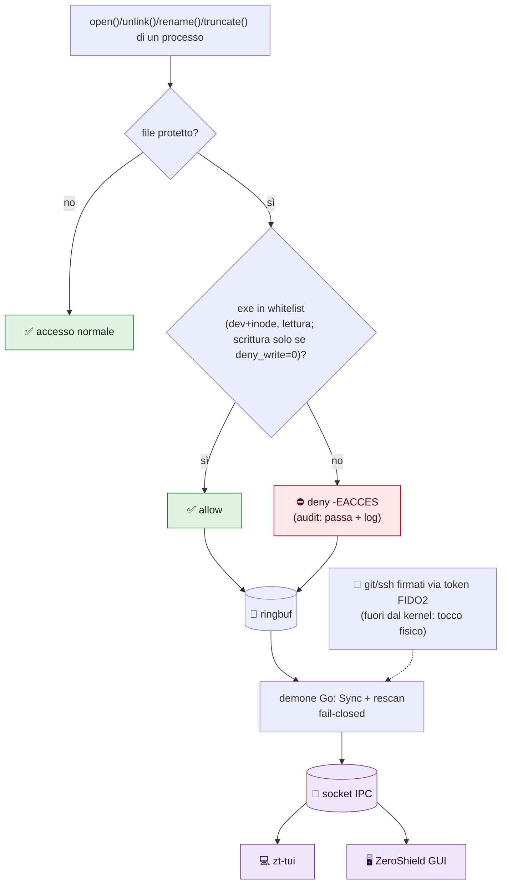

<p align="center">
  
</p>
<h1 align="center">ZeroShield</h1>
<p align="center"><b>Lo scudo zero-trust nel tuo kernel Linux.</b><br/>
Difende segreti e rete del portatile da Wi-Fi ostili, dipendenze avvelenate e ladri di token — senza server, senza cloud, senza account.</p>
<p align="center">
  <a href="#-provalo-in-60-secondi-senza-root">Provalo in 60 secondi</a> ·
  <a href="#interfacce-tui--gui-senza-root">TUI + GUI</a> ·
  <a href="#-profili">Profili</a> ·
  <a href="docs/TESTING_LAB.md">Lab di test</a>
</p>
<p align="center"><i>MIT © 2026 ZioZoni95 · binari: <code>zt-shield</code> <code>zt-tui</code> <code>zt-gui</code></i></p>
<p align="center">
  <a href="https://github.com/ZioZoni95/ZeroShield/actions/workflows/ci.yml"></a>
  
  
  
  
  
  
</p>

> [!WARNING]
> **Progetto sperimentale, mai testato su macchina fisica.** Gli hook LSM che proteggono i
> segreti passano il verifier del kernel, ma non sono mai stati **agganciati** su una
> macchina reale: il blocco effettivo dei file non è ancora stato visto funzionare. Usalo in **VM** e in modalità `audit` finché
> `zt-probe` e il collaudo di [`docs/TESTING_LAB.md`](docs/TESTING_LAB.md) non passano
> sulla tua macchina. Stato dettagliato in [`docs/TEST_SANDBOX.md`](docs/TEST_SANDBOX.md).

| Componente | Stato | Come è stato verificato |
|---|---|---|
| XDP anti-poisoning + radar | ✅ **testato su kernel reale** | `zt-probe -xdp-lo`: verifier ok, 5355/5353 droppati, 9999 passa |
| Canary anti-ransomware (fanotify) | ✅ **testato su kernel reale** | tocco esca, allarme di massa, kill in enforce (`make test-root`) |
| TUI / GUI / mock | ✅ testato | `zt-tui --dump` contro `zt-mockd`; build GUI in CI |
| Config, IPC, audit, whitelist | ✅ test unitari | `go test -race`, fuzz, CI |
| **Hook LSM (segreti)** | 🟡 **verifier ok, mai agganciato** | `zt-probe` in CI: i 4 programmi accettati dal kernel del runner GitHub; attach + blocco reale da provare in VM |
| Pacchetti `.deb` | ✅ testato | installazione, reinstallazione, rimozione (`make package`) |
| Script (`harden_system.sh`, …) | ⚠️ mai eseguiti | solo `shellcheck` / `bash -n` |

---

## ⚡ Provalo in 60 secondi (senza root)

Niente kernel, niente rischi: dati finti, solo per vedere le interfacce.

```bash
make build-tui build-mock
ZT_SOCKET=/tmp/z.sock ./bin/zt-mockd &
ZT_SOCKET=/tmp/z.sock ./bin/zt-tui   # tab Stato · Eventi · Regole · Rete · Radar
```

## 🛡️ Come ti protegge (quando lo attivi)

| 🛡️ | Livello | Esempio concreto |
|---|---|---|
| 🔒 | **Segreti** (eBPF LSM) | `cat ~/.aws/credentials` da script malevolo → `Permesso negato`, `kubectl` continua a funzionare |
| 📡 | **Radar rete** (eBPF XDP) | Poisoning LLMNR/mDNS e scansioni droppate prima dello stack, sorgenti sul radar |
| 🧱 | **Sistema** | Firewall deny-incoming, DNS cifrato, anti ARP-spoof |
| 🐤 | **Esche anti-ransomware** (fanotify) | Chi apre `~/Documents/.canary-wallet.dat` viene ucciso in enforce; cancellazioni di massa → allarme |
| 🔑 | **Identità** (FIDO2) | Commit firmati col tocco fisico: senza token, niente firma |

> **Kernel-Enforced Local Security Agent for Linux Workstations**
> *Difesa in profondità locale a livello kernel contro reti ostili, malware che ruba credenziali e movimenti laterali.*

---

## 📋 Panoramica

`zt-shield` è un agente di sicurezza locale per postazioni Linux (sviluppo e uso quotidiano) che operano in reti non fidate o su cui può girare codice non fidato.

Implementa il paradigma **Zero-Trust ("Never Trust, Always Verify")** a livello kernel con **eBPF (XDP + LSM)**, affiancato da hardening del sistema operativo e credenziali hardware non estraibili (**FIDO2**). Non richiede un'infrastruttura: gira sul tuo portatile.

### Contro cosa protegge

| Scenario | Minaccia | Cosa fa lo scudo |
|---|---|---|
| **Wi-Fi pubblico** (hotel, aeroporto, bar) | Poisoning LLMNR/mDNS/NBT-NS, ARP spoofing, DNS ostile, scansioni di altri client | Drop XDP dei protocolli di poisoning, firewall `deny incoming`, DNS cifrato (DoT) ignorando quello del DHCP, sysctl anti-redirect/ARP |
| **Supply-chain** (dipendenza npm/PyPI/Cargo compromessa, script `curl \| sh`) | Il codice gira con i tuoi permessi e legge `~/.ssh`, `~/.aws`, token, cookie | LSM: solo i binari in whitelist aprono i segreti, ogni altro tentativo è negato e loggato con PID ed exe |
| **Infostealer / malware utente** | Esfiltrazione di cookie e password del browser, chiavi, wallet | Regole `browsers`, `gpg`, `tokens` + regole personalizzate (`extra_rules`) |
| **LAN domestica** (IoT, ospiti, altri PC) | Dispositivi compromessi che sondano la macchina | `deny incoming`, drop poisoning, blocco subnet opzionale |
| **Rete aziendale / dominio compromesso** | DNS spoofing, movimento laterale, poisoning tramite Responder/Inveigh | Come sopra + `block_subnets` per le subnet ostili |
| **Furto/impersonificazione dell'identità** | Chiave SSH rubata, commit falsificati a tuo nome | Chiavi FIDO2 `ed25519-sk` (PIN + tocco), commit firmati |

Ogni scenario ha un **profilo** pronto (vedi [Profili](#-profili)).




---

## 🗂️ Struttura della Repository

```text
ZeroShield/
├── README.md                   # Questo file
├── LICENSE                     # MIT © 2026 ZioZoni95
├── docs/
│   ├── PUNTI_APERTI.md         # Stato, decisioni aperte e checklist
│   ├── CANARY.md               # Canary anti-ransomware: guida d'uso, taratura, design
│   ├── FEATURE_PLAN.md         # Estensioni pianificate (VPN kill-switch, egress)
│   ├── FEATURE_STUDY.md        # Pseudosoluzioni annotate per le feature
│   ├── ROADMAP.md              # Piano unificato a fasi + feature originali
│   ├── VPN_SETUP.md            # ProtonVPN + kill-switch: setup e test
│   ├── FIX_APPLICATI.md        # Fix applicati e ancora da applicare
│   ├── TESTING.md              # Collaudo pratico (LSM, XDP, network namespaces)
│   ├── TESTING_LAB.md          # Scenario lab reale in VM isolata (post-fix)
│   ├── TEST_SANDBOX.md         # Cosa è stato testato davvero, dove e come
│   ├── UI_RESEARCH.md          # Ricerca TUI/GUI e architettura IPC
│   └── gemini-code-1790668303538.md # Specifiche iniziali e storico
├── Makefile                    # make build | probe | test | test-root | package | package-gui | gui
├── packaging/                  # nfpm (.deb), unit systemd, script del pacchetto, .desktop
├── .github/                    # CI (5 job + zt-probe), release sui tag v*, Dependabot
├── go.mod
├── bpf/
│   ├── zerotrust.c             # Kernel C: XDP (rete) e LSM (open/unlink/rename/truncate)
│   └── gen.go                  # go:generate bpf2go (stub Go generati, non versionati)
├── cmd/zt-shield/main.go       # Entrypoint del demone
├── cmd/zt-tui/main.go          # TUI Bubble Tea (stato/eventi live, senza root)
├── cmd/zt-mockd/main.go        # Finto demone con dati sintetici (verifica UI senza root/eBPF)
├── cmd/zt-probe/main.go        # Collaudo kernel: verifier per programma + XDP su loopback
├── pkg/ipc/                    # Socket Unix stato+eventi (demone root → UI utente)
├── zt-gui/                     # GUI desktop Wails stile macOS (vedi docs/UI_RESEARCH.md)
├── internal/
│   ├── config/                 # Profili, regole, parsing YAML, validazione (+ test)
│   ├── lsm/                    # Sync mappe file/binari, attach hook LSM
│   ├── xdp/                    # Attach XDP (generic), trie LPM subnet
│   ├── audit/                  # Consumer ring buffer, output text/JSON
│   ├── canary/                 # Esche anti-ransomware (fanotify)
│   └── watchdog/               # sd_notify per il watchdog systemd
├── configs/shield.example.yaml # Configurazione commentata
└── scripts/
    ├── check_prereqs.sh        # Kernel, BTF, LSM bpf, toolchain
    ├── harden_system.sh        # Hardening per profilo: UFW, resolved, sysctl
    ├── setup_fido2.sh          # Chiave SSH FIDO2 + firma commit Git
    └── install_service.sh      # Installazione come servizio systemd
```

---

## 🎯 I Livelli di Protezione

### 1. Network Layer (eBPF XDP + UFW)
* **Drop dei protocolli di poisoning:** LLMNR (5355), mDNS (5353), NBT-NS (137/138) scartati in ingresso prima dello stack TCP/IP. Attivo di default (`block_poisoning`).
* **Blocco subnet opzionale:** `block_subnets` con Longest Prefix Match. Attenzione: scarta anche le risposte da quelle reti.
* **Supporto universale:** `XDP_GENERIC`, funziona su Wi-Fi, Ethernet e VPN.
* **Firewall:** UFW `default deny incoming` (via `harden_system.sh`).

### 2. Secret & Data Layer (eBPF LSM)
* **Regole per gruppo di segreti:** ogni regola associa file (percorsi, glob, directory ricorsive) ai soli binari autorizzati.
* **Identità del binario, non del nome:** la whitelist confronta dev+inode dell'eseguibile (`mm->exe_file`). Rinominare un binario in `ssh` non basta.
* **Chiave dev+inode:** sopravvive a rename; il rescan (default 30s) copre file nuovi, binari aggiornati da apt e rimuove voci obsolete.
* **Modalità `audit` / `enforce`:** `audit` logga senza bloccare, per adottare lo scudo senza rompere i flussi di lavoro.
* **Audit in tempo reale:** ogni evento riporta regola, PID, `comm` ed `exe` del processo (utile per decidere cosa autorizzare); formato `text` o `json`.
* **Fail-closed:** se l'hook LSM non si aggancia, il demone si ferma invece di fingersi attivo.

### 3. Anti-Ransomware Layer (canary + fanotify)
* **Esche:** file finti e nascosti (`.canary-*.xlsx`, `.dat`, `.zip`) nelle cartelle scelte; nessun uso legittimo li apre.
* **Tocco esca:** `SIGKILL` al processo in `enforce`, allarme in `audit`, notifica desktop sempre.
* **Massa:** troppe scritture/cancellazioni/rinomine di un PID in pochi secondi → allarme (mai kill).
* **Spento di default:** si tara una settimana in `audit`. Guida completa in [`docs/CANARY.md`](docs/CANARY.md).

### 4. Identity & Non-Repudiation Layer (FIDO2)
* **Chiavi non estraibili:** `ed25519-sk` residente, PIN + tocco (`verify-required`). Senza token, `setup_fido2.sh` ripiega su una chiave software (protezione più debole).
* **Commit firmati** via SSH con `allowed_signers` per la verifica locale.
* **Anti SSH-agent hijacking:** `ssh-add -c` per le chiavi software.

### 5. Protocol & OS Hardening
* **Anti-poisoning:** LLMNR e mDNS disattivati in `systemd-resolved`.
* **DNS sicuro (profili `public-wifi`/`paranoid`):** DNS-over-TLS verso resolver globali, ignorando quelli del DHCP; DNSSEC `allow-downgrade`.
* **Sysctl di rete:** niente ICMP redirect / source routing, `rp_filter` loose, meno informazioni ARP su reti ostili.
* **Servizi di discovery:** `avahi-daemon` disabilitato nei profili per reti non fidate.

---

## 🧩 Profili

| Profilo | Modalità | Regole | Hardening (`harden_system.sh`) |
|---|---|---|---|
| `home` *(default)* | `audit` | ssh, cloud, tokens, gpg | UFW, no LLMNR/mDNS, sysctl base |
| `corporate` | `enforce` | ssh, cloud, tokens, gpg | come `home`; DNS interni mantenuti |
| `public-wifi` | `enforce` | + browsers (cookie, password) | + DoT opportunistic, `Domains=~.`, ARP, avahi off |
| `paranoid` | `enforce` | come `public-wifi` | DoT `yes` (senza captive portal) |

Gruppi di regole:

| Gruppo | Protegge | Autorizzati |
|---|---|---|
| `ssh` | `~/.ssh/id_*` | ssh, ssh-add, ssh-agent, ssh-keygen, scp, sftp |
| `cloud` | `.kube/config`, `.aws/credentials`, credenziali Terraform | kubectl, helm, k9s, aws, terraform, tofu |
| `tokens` | `.git-credentials`, `.docker/config.json`, `gh/hosts.yml`, `.cargo/credentials.toml` | git, gh, docker, cargo |
| `gpg` | `~/.gnupg/private-keys-v1.d/` | gpg, gpg-agent, gpgsm |
| `browsers` | Cookie, Login Data, `key4.db`, `logins.json` di Chrome/Chromium/Firefox (anche snap) | i binari dei browser |

Aggiungi i tuoi segreti (wallet crypto, password manager, ecc.) con `extra_rules` in [`configs/shield.example.yaml`](configs/shield.example.yaml).

> [!IMPORTANT]
> Tool con shebang (`npm`, `pip`, `gcloud`, `az`) **non sono in whitelist** di proposito: il processo che apre il file è l'interprete (`node`, `python`), e autorizzarlo autorizzerebbe qualunque script, compresi gli `postinstall` malevoli. Per quei token usa credenziali a breve durata o un keyring.

---

## ⚙️ Prerequisiti di Sistema

* **OS:** Ubuntu 22.04 / 24.04 o qualsiasi Linux con kernel >= 5.15 e BTF (`/sys/kernel/btf/vmlinux`).
* **BPF LSM attivo nel kernel:**
  ```bash
  cat /sys/kernel/security/lsm
  ```
  Se manca `bpf`, **appendilo alla lista esistente** (non sostituirla):
  ```bash
  CURRENT_LSM="$(cat /sys/kernel/security/lsm)"
  sudo cp /etc/default/grub /etc/default/grub.bak
  sudo sed -i "s|^GRUB_CMDLINE_LINUX=\"|GRUB_CMDLINE_LINUX=\"lsm=${CURRENT_LSM},bpf |" /etc/default/grub
  sudo update-grub && sudo reboot
  ```
* **Toolchain:**
  ```bash
  sudo apt update
  sudo apt install -y clang llvm libbpf-dev linux-tools-common linux-tools-generic make libfido2-dev fido2-tools ufw
  ```
  `bpftool` arriva con `linux-tools-generic` (su Ubuntu 24.04 non esiste un pacchetto `bpftool`): il `Makefile` lo trova da solo, altrimenti `make build BPFTOOL=/percorso/bpftool`.
  Serve **Go ≥ 1.26** (`go.mod` dichiara `toolchain go1.26.8`, che Go scarica da solo). Se l'apt è più vecchio: `sudo snap install go --classic`.

---

## 📦 Installazione da pacchetto (Ubuntu / Debian)

Ogni tag `v*` pubblica una [release](https://github.com/ZioZoni95/ZeroShield/releases) con due pacchetti `.deb` e i checksum:

```bash
sha256sum -c SHA256SUMS --ignore-missing
sudo apt install ./zeroshield_*_amd64.deb          # demone, zt-tui, zt-probe, servizio
sudo apt install ./zeroshield-gui_*_amd64.deb      # app desktop (dipende dal demone: installandolo hai tutto)

sudoedit /etc/zt-shield/shield.yaml                # user: <tuo-utente>   (obbligatorio)
sudo zt-probe -xdp-lo                              # il kernel accetta i programmi?
sudo systemctl enable --now zt-shield              # parte in audit (profilo home)
zt-tui                                             # stato ed eventi live
```

Il servizio **non** si avvia da solo all'installazione. Script di sistema in `/usr/share/zeroshield/scripts/`, documentazione in `/usr/share/doc/zeroshield/`. Da sorgente: `make package && sudo apt install ./dist/zeroshield_*.deb`.

---

## 🚀 Guida Rapida (da sorgente)

```bash
# 1. Verifica prerequisiti
bash scripts/check_prereqs.sh

# 2. Compila (genera vmlinux.h, stub eBPF, binario)
make build

# 2b. Il kernel accetta i programmi? (verifier per programma + XDP su loopback)
make probe

# 3. Prova in primo piano (profilo home = solo audit, non blocca nulla)
sudo SHIELD_USER=$USER ./bin/zt-shield

# 4. Hardening di sistema per il tuo scenario
sudo bash scripts/harden_system.sh home        # oppure: corporate | public-wifi | paranoid

# 5. Identità hardware (opzionale ma consigliato)
bash scripts/setup_fido2.sh

# 6. Installa come servizio e osserva i log
sudo bash scripts/install_service.sh $USER home
journalctl -u zt-shield -f
```

**Adozione consigliata:** tieni `mode: audit` finché nei log non compaiono più accessi legittimi (`exe=...` ti dice quale binario autorizzare), poi passa a `mode: enforce` in `/etc/zt-shield/shield.yaml` e riavvia il servizio.

### Collaudo
```bash
cat ~/.kube/config                                       # enforce: Permission denied; il log mostra regola, PID, exe
cp /usr/bin/cat /tmp/ssh && /tmp/ssh ~/.kube/config      # deve restare negato (whitelist per identità, non per nome)
kubectl get pods                                         # consentito
```

---

## 🚧 Limiti noti (riletti 2026-10-02, fedeli al codice)

* **Root locale = game over:** chi ha root scarica gli hook e legge tutto. Difende da processi utente e rete, non da privilege escalation. Aiutano solo LUKS + backup offline.
* **Hook su `file_open`, `unlink`, `rename` (sorgente e destinazione), `truncate`; niente `ptrace`.** `ptrace` sullo stesso UID legge la memoria di `ssh` (mitigato da `yama.ptrace_scope=1`). `LD_PRELOAD` su un binario in whitelist dinamico (`ssh`, `git`, `gpg`) esegue codice con la sua identità: stesso limite strutturale della whitelist.
* **Write-only passa di proposito:** creazione chiavi e backup funzionano, ma anche la sovrascrittura malevola senza troncare. `O_TRUNC` e `truncate(2)` passano invece dalla whitelist; su kernel ≥ 6.2 `ftruncate` di un fd write-only resta scoperto. Per segreti immutabili usa `deny_write`.
* **Whitelist solo per binari di root:** binari (o directory padri) scrivibili da un utente non root, es. `~/.local/bin`, vengono scartati con log `⛔`: altrimenti basterebbe riscriverli per ereditarne l'accesso.
* **Whitelist per binario, non per catena:** ogni binario in lista legge i suoi file per chiunque lo invochi (`git` fuori da `ssh-keys`, ma dentro `dev-tokens`). Il segreto forte è la chiave FIDO2.
* **`io_uring` = fail-open:** worker senza `mm` passa senza evento. Scelta contro falsi blocchi, resta bypass tecnico.
* **XDP: solo IPv4, un tag VLAN, niente IPv6.** IPv6 coperto solo da `systemd-resolved`. `interface` accetta lista; UP scoperte segnalate nel log.
* **`block_subnets` scarta anche le risposte:** mai gateway/DNS dentro; prefissi `/<8` rifiutati.
* **btrfs/overlay = protezione inerte:** chiave non matcha, ora con warning a avvio (`CheckFilesystem`). Su ext4/xfs funziona.
* **Servizio fermo = zero protezione:** nessun pinning; `StartLimit`+`ExecStartPre` evitano solo il morto-silenzioso.
* **FIDO2 software = segreto su disco:** senza token fisico, firma senza tocco.
* **Canary:** il kill arriva dopo il tocco e non ferma la cifratura in-place che salta le esche; sotto systemd serve `ReadWritePaths=` per le cartelle delle esche ([`docs/CANARY.md`](docs/CANARY.md) §3.2).
* **Non è antivirus/IDS/egress e non cifra:** su Wi-Fi ostile serve comunque la VPN. Novità: stanza `vpn:` + `scripts/vpn_killswitch.sh` (solo traffico tunnel, con rollback) e auto-VPN su BSSID fidati (`scripts/nm_vpn.sh`, Proton incluso). Dettagli in [`docs/VPN_SETUP.md`](docs/VPN_SETUP.md). Browser Flatpak/custom vanno in `extra_rules`, verifica in `audit` prima di `enforce`.

---

## 🖥️ Interfacce: TUI + GUI (senza root)

Il demone gira root e pubblica stato/eventi sul socket `/run/zt-shield/api.sock` (`pkg/ipc`). Le interfacce girano come utente, in sola lettura: niente eBPF toccato dalle UI.

| Strumento | Cosa è | Avvio |
|---|---|---|
| `zt-tui` | Terminale a tab (Stato/Eventi/Regole/Rete/Radar, live, filtro `f`, blast-radius, auto-suggest) | `./bin/zt-tui` (demone attivo) |
| `zt-mockd` | Finto demone con dati inventati, per vedere le UI senza root né eBPF | `ZT_SOCKET=/tmp/z.sock ./bin/zt-mockd &` + `ZT_SOCKET=/tmp/z.sock ./bin/zt-tui` |
| `zt-gui` | Finestra desktop stile macOS (sidebar a sezioni, dashboard sessione, search, radar canvas, Guida primo avvio) | `make gui`, poi `./zt-gui/build/bin/zt-gui` |

```bash
make build-tui   # TUI (pura Go, senza toolchain eBPF)
make build-mock  # mock (idem)
make gui         # GUI (richiede wails CLI, Node, libgtk-3-dev, libwebkit2gtk-4.1-dev)
```

Anteprima TUI senza TTY: `./bin/zt-tui --dump`. Nota: fuori da env snap le GUI GTK vanno lanciate con `GTK_PATH`/`GIO_MODULE_DIR` ripuliti (vedi `docs/PUNTI_APERTI.md`). Dettagli ricerca in [`docs/UI_RESEARCH.md`](docs/UI_RESEARCH.md).

<details><summary>Anteprima tab Radar (dati di esempio)</summary>

```
🛡️ zt-shield  ● AUDIT (logga)
 1 Stato   2 Eventi   3 Regole   4 Rete  [5 Radar]

        ···●·······
     ····         ····
 ·   ··  ···   ···  ··   ·
 ·   ·   ·   +∙∙∙∙∙●∙∙∙∙∙·
   ··   ··········●   ··

192.168.100.7      34  █████ poisoning
192.168.100.23    128  ██████████████████ subnet
```
</details>

---

## 📖 Riferimenti
* Specifiche tecniche iniziali e storico evolutivo: [gemini-code-1790668303538.md](docs/gemini-code-1790668303538.md).
* Stato e attività aperte: [docs/PUNTI_APERTI.md](docs/PUNTI_APERTI.md).
* Guida agli scenari di collaudo pratico: [docs/TESTING.md](docs/TESTING.md).
* Cosa è stato testato su kernel reale e come rifarlo: [docs/TEST_SANDBOX.md](docs/TEST_SANDBOX.md).
* Canary anti-ransomware, uso e taratura: [docs/CANARY.md](docs/CANARY.md).
