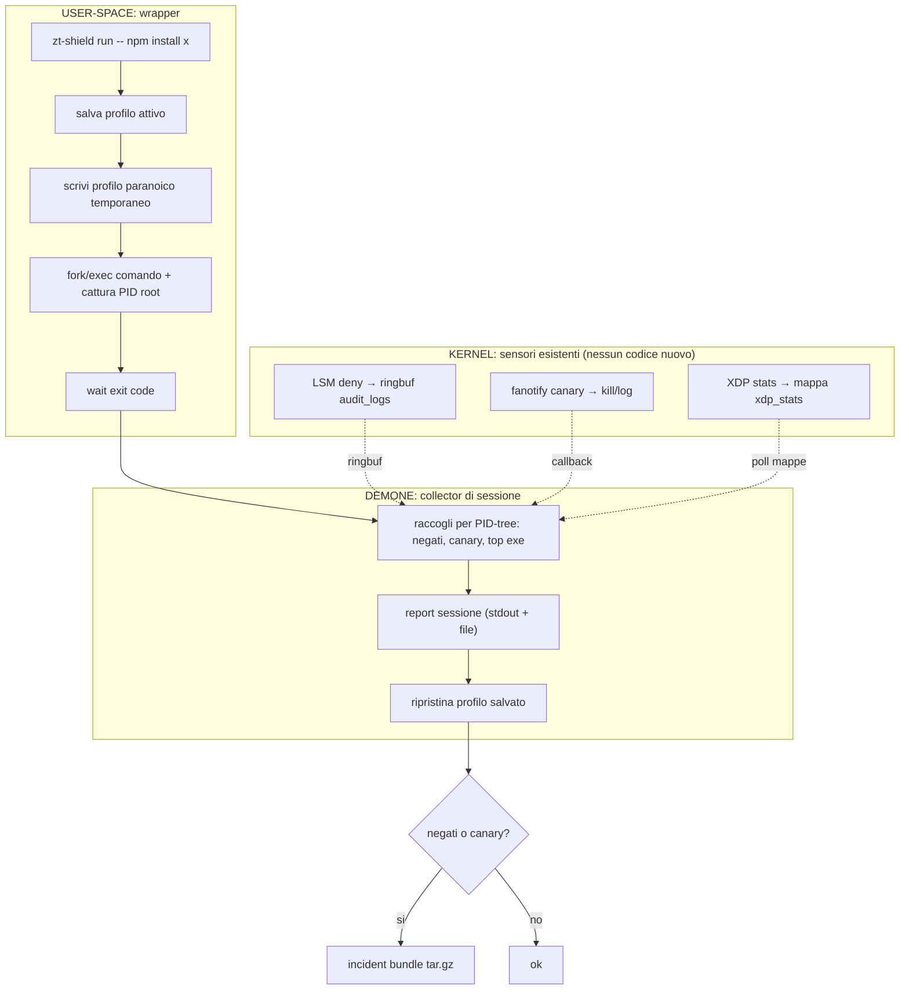
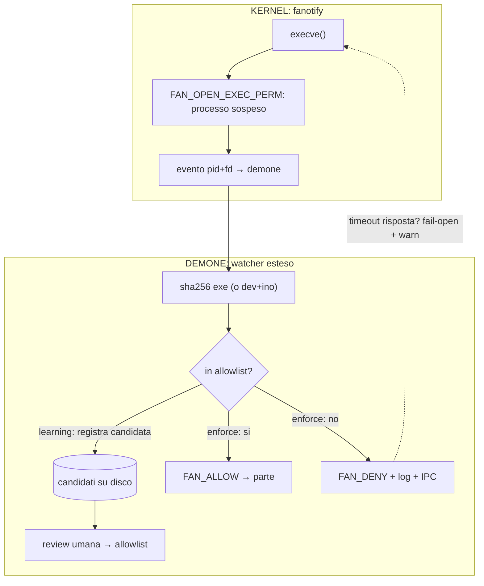
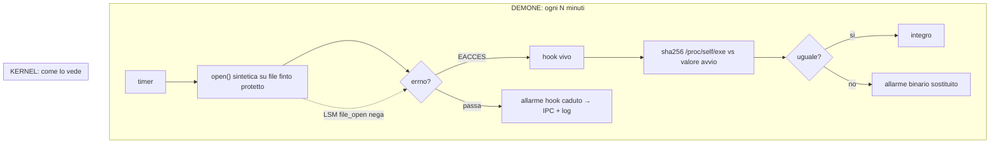
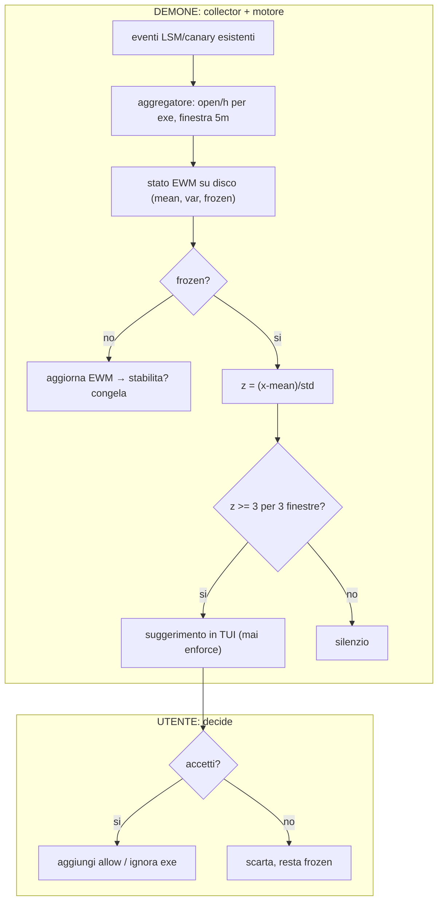

# FEATURE_DEEP_STUDY — studio con fonti di tutte le feature (2026-10)

Metodo: per ogni feature, stato dell'arte dal web → cosa copiamo → cosa è
nostro → effort. Niente implementato qui.

## 1. Install-session mode

Fonti: `chain-eye` (11 probe eBPF, sessioni npm/pip, 28 regole YAML),
`kojuto` (sandbox + honeypot credenziali + libfaketime, 100% TPR su dataset
Datadog), `trace-npm` (strace + HOME finta con canary), Datadog (execution
contexts che raggruppano eventi per albero `npm install`).
Originalità: i tool esistenti portano eBPF propri o sandbox pesanti. Nostro:
riuso sensori già attivi (LSM deny + canary + radar) con profilo temporaneo
paranoico + report. Zero kernel nuovo. Effort: giorni (wrapper + report).

## 2. Exec-allowlist fanotify

Fonti: `fapolicyd` (RHEL, trust da RPM db, `FAN_OPEN_EXEC_PERM`),
systemshardening.com (guida fanotify: permessi bloccanti, PIDFD anti-TOCTOU,
gap mmap anonimo coperto solo da LSM `mmap_file`).
Originalità: media. Il meccanismo è standard; originale è l'integrazione nel
profilo personale con learning-mode + allowlist esistenti. Effort: medio.
Nota: `mmap(PROT_EXEC)` anonimo resta buco noto anche lì.

## 3. Honeytoken con lineage

Fonti: Koney/Dynatrace (deception-as-code k8s, honeytoken + Tetragon),
Datadog execution contexts, kntrl ancestry `npm>node>curl`, TraceTree (grafi
NetworkX con firme temporali).
Originalità: packaging workstation-singola coi nostri sensori; lineage via
`/proc` racy ma economica. Effort: basso.

## 4. Incident bundle

Fonti: prassi comune (GhostCatcher quarantine vault, EDR forensics).
Originalità: nessuna — comodità. Effort: basso. Avviso: bundle con dati
sensibili → 0600 o cifratura.

## 5. Shadow-verify suite + 6. Self-hash

Fonti: Red Canary Coalmine/Vuvuzela (emulazione avversari schedulata),
GhostCatcher `selfguard` (sha256 + systemd watchdog), OmniShield (self-hash
60s), CIRISVerify (self-check con manifest firmato), gomcp antitamper (Go).
Originalità: alta per shadow-verify LSM sintetico (quasi nessuno fa self-test
continuo dell'enforcement in locale); commodity per self-hash. Effort:
ore (hash) / giorni (suite).

## 7. AI adattiva (solo baseline statistiche)

Fonti: Aura-Process-Guardian (z-score per-processo, offline, spiegabile),
KOBRA (paper: baseline per-app, 95% accuracy), memgar EWM (freeze baseline
per non farla derive sotto attacco), fullmon (baseline + rebase per server
statici), Novikova (tipicità vs malignità, senza ML).
Disegno nostro: EWM per exe (open/h, orari), freeze sotto attacco, z-score,
mai auto-enforce. Niente LLM (non deterministico), niente cloud (dati a casa).
Effort: medio. Opt-in, mai default.

## 8. USB allowlist

Fonti: USBGuard (maturo, rule language, GNOME integrato), kernel
`authorized_default`, Red Hat docs.
Verdetto: NON reimplementare. Integrazione documentata + check prerequisiti.

## Sintesi ordine

6 (ore) → 5/1 (giorni, valore) → 2/3 (medio) → 7 (opt-in) → 4 (comodità).
8 = docs. LKM gate resta Fase 3 con Secure Boot.

## Diagrammi delle pseudosoluzioni (architettura + flusso dati)

Legenda: i dati attraversano kernel → demone → UI. Ogni freccia dice cosa
viaggia davvero (syscall, mappa, socket, file).

### Install-session mode

### Exec-allowlist fanotify (learning → enforce)

### Shadow-verify + self-hash (loop)

### Baseline adattiva EWM (mai auto-enforce)

